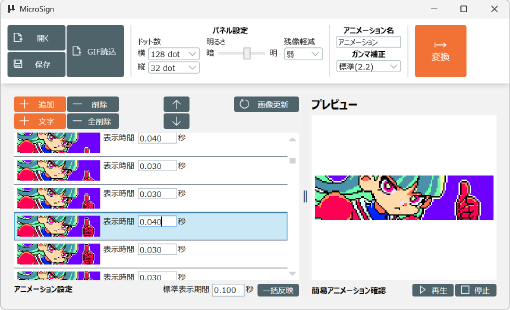
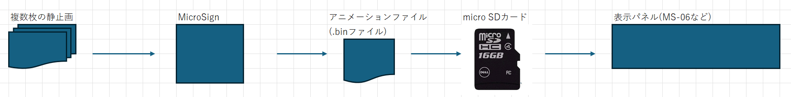
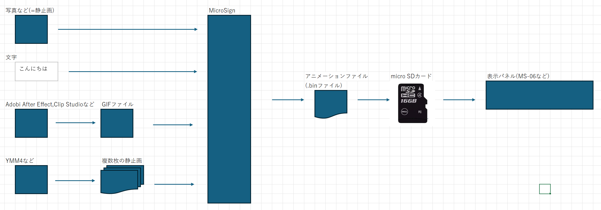

## MicroSignの概要

MicroSignシリーズの表示パネル(MS-06など)でアニメーションを表示するには「専用のアニメーションファイル」を必要とします。
この専用のアニメーションファイルを作成するのが「MicroSign」アプリケーションとなります。

MicroSignでは静止画を連続して表示する「パラパラ漫画方式のアニメーション」を作成します

表示パネルのサイズに合わせた静止画を複数枚用意し、
それぞれの静止画に対して何秒間表示するかを設定することでアニメーションを作成します

作成したアニメーションは「変換」することで「専用のアニメーションファイル」(.binファイル)を作成します。
この作成した専用のアニメーションファイルをmicro SDカードに入れ、表示パネル(MS-06など)に挿入することでアニメーションが表示されます。

これら全体の流れは以下となります

また複数枚の静止画を用意しなくても
簡単にアニメーションを作成する機能として

- 写真をスクール表示する
- 文字列をスクロール表示する

機能が存在します。

アニメーションの作成が難しい場合にご活用ください.

本格的なアニメーションを表示したい場合は

- Adobi After Effect,Clip Studioなどを使ってGIFアニメーションファイルを作成する
- ゆっくりMovieMaker4(YMM4)などを使っての連番の静止画を作成する

など外部ツールを使用してください

これらの以下のような流れになります

この中で一番のおすすめは「GIFファイル」を使用する方法です

これは表示パネル側の制約により「最大256色までしか使用できない」制限があるためです。

静止画をそのまま使うとこの表示側の制限である256色を超えてしまうため、
MicroSignで専用アニメーションを作成するときに減色処理が行われます。
ただこの減色処理はAdobi After Effectなどに比べると非常に簡素なものとなっているため
Adobi After EffectでGIFファイルを作成した方がきれいな映像が表示されます。
