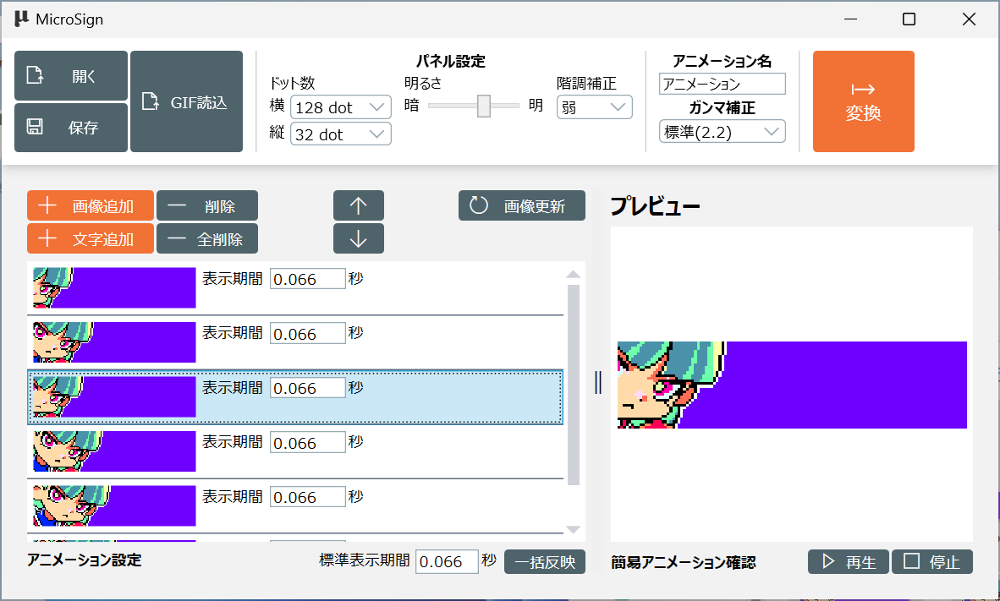
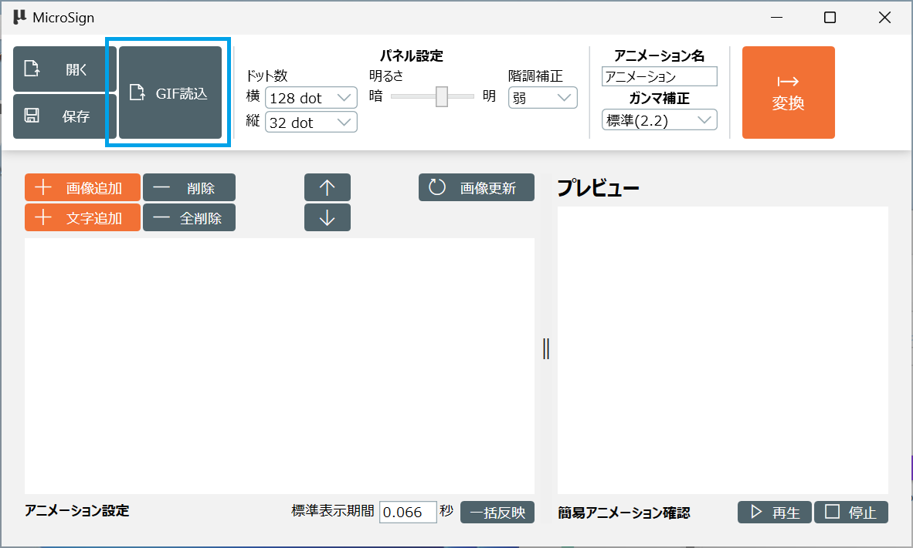
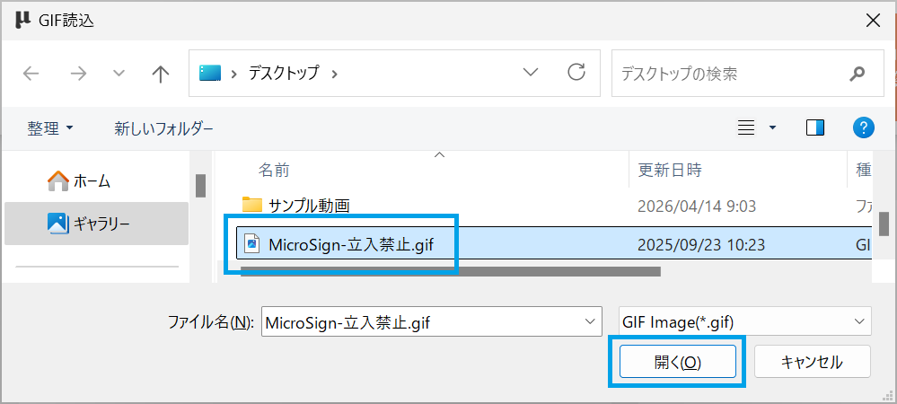
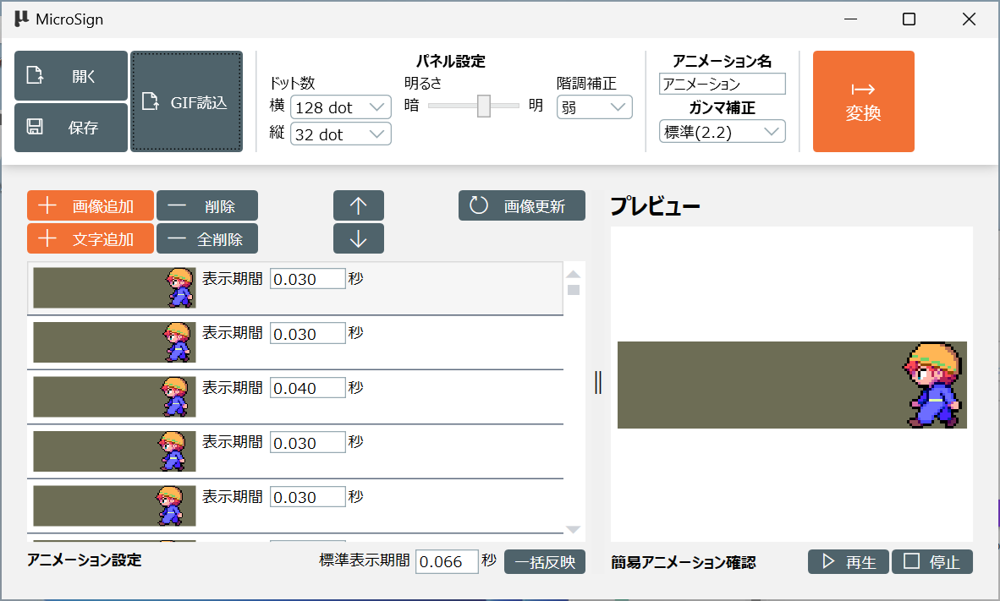

[操作マニュアル - TOP](./microsign_manual.md) 

## 基本操作

### 目次

[画面構成](#画面構成)

[表示パネル設定](#表示パネル設定)

[アニメーション作成](#アニメーション作成)

[連番静止画のアニメーション作成](#連番静止画のアニメーション作成)

[プレビュー](#プレビュー)

[変換](#変換)

[保存](#変換)

[開く](#開く)

[新規作成](#新規作成)

[フレームを１つ削除](#フレームを１つ削除)

[フレームを1つ前に移動](#フレームを1つ前に移動)

[フレームを1つ後に移動](#フレームを1つ後に移動)

[フレームの画像を更新](#フレームの画像を更新)

[GIFアニメーションの読込](#GIFアニメーションの読込)

### 画面構成

MicroSign を起動すると以下の画面が表示されます


画面は３ペイン構成で

- (1)がツールバー
- (2)がタイムライン
- (3)がプレビュー画面

となります


---
### 表示パネル設定

アニメーションの作成を開始する前に
「パネル設定」の「ドット数」を設定してください。

設定するドット数は表示パネル毎に異なるので、表示パネルの仕様をご確認ください。

今回は「MS-06」を対象とするので横128ドット、縦32ドットに設定します


以上でアニメーションを作成する準備が完了です

---
### アニメーション作成
ここではアニメーションの作り方を説明します

#### 1.フレームを追加

**表示パネルのサイズと同じサイズの静止画**を
タイムラインにドラッグ&ドロップしてください。


これで該当静止画がフレームとして追加されます。


#### 2.表示する秒数を設定

追加したフレームを何秒間表示するか「表示期間」に設定します。

現状fpsで指定する方法がないのですが、
その場合は以下の表示期間を使用してください

|FPS     |計算式   |表示期間  |
|--------|--------|----------|
| 60 fps | 1 / 60 |  0.016   |
| 30 fps | 1 / 30 |  0.033   |
| 20 fps | 1 / 20 |  0.050   |
| 15 fps | 1 / 15 |  0.066   |
| 10 fps | 1 / 10 |  0.100   |

今回は 15 fps としたいので「0.066」を設定します


#### 3.繰り返し
以上の1と2を繰り返してフレームを追加し、アニメーションを完成させます


---
### 連番静止画のアニメーション作成

先の方法では静止画を1枚づつ設定しましたが、
静止画のファイル名が連番となっている場合は一括でフレームとして追加することができます。

まず追加するフレームの表示期間を1つずつ変更せずに済むように
ドラッグ＆ドロップ前に「標準表示期間」を設定します。


連番の静止画を複数選択し、タイムラインにドラッグ&ドロップします


以上でフレームを一括で追加できます


---
### プレビュー

アニメーションが完成したらプレビューで確認します

プレビューの右下にある「再生」をクリックしてください


これでアニメーションのプレビューができます


プレビューを終了する場合は「停止」をクリックします


---
### 変換

アニメーションが作成出来たら表示パネル向けの専用アニメーションデータに変換します

まず変換する前に作成するアニメーション用の設定を行います

#### 1. 明るさ設定

表示パネルの仕様によるのですが、表示する映像の明るさを変更できる場合があります。

今回使用している「MS-06」は対応していない(=変更しても変わらない)ので、そのままとします。


#### 2. 階調補正

表示パネルはLEDの発光加減により明暗を表現しているのですが、
LEDの特性によりどうしてもモニタで確認しているよりも階調が明るくなりがちになります。
これを抑止するために表示パネル側でLEDの発光を調整し階調を自然にする機能です。

階調調整を強くするとLEDの発光加減が弱くなるので**映像が暗く**なります。

このため室内で使用する場合は「弱」がおすすめです。

室外に向けて表示する場合は、太陽光がかなり明るいので
「なし」に設定した方が自然な明るさで表示できます


#### 3. アニメーション名

アニメーションを区別するための名前です。
どこにも表示されないので設定しなくてよいです


#### 4. ガンマ補正
表示パネルに渡すアニメーションデータ内の映像に対してガンマ補正を行います。

表示パネルはLEDを使用して表示しているため、一般的なパソコンの液晶モニターと異なる表示特性を持っています。
このため液晶モニターできれいな色合いにしても、表示パネルで表示すると異なる色合いで見えることがあります。
これを補正するのがガンマ補正で、「標準(2.2)」に設定することで液晶モニターの色合いに近づけることができます。

店内などの明るい照明がある場合は「中(1.8)」や「弱(1.4)」、
室外に向けて表示する場合は太陽がかなり明るいので「弱(1.4)」「補正なし」を選んでください。


#### 5. 変換

アニメーション用の設定が終わったら「変換」をクリックして専用アニメーションデータに変換します


保存ダイアログが表示されるので、**ファイル名は「MicroSignImage.bin」まま**で
保存先のフォルダを選択し「保存」をクリックします

※表示パネルはファイル名「MicroSignImage.bin」を表示するアニメーションのファイルと認識するので、
ファイル名は変更しないでください


「MicroSignImage.bin」が生成されれば変換完了です


#### 6. micro SDカードにコピー

micro SDカードの**ルート**に生成した「MicroSignImage.bin」をコピーしてください。

ファイルをコピーする時「MicroSignImage.bin」というファイル名は変更しないでください。

表示パネルはmicro SDカードの**ルート**にある**MicroSignImage.bin**というファイルを
再生するアニメーションとして認識するので、ルートになかったり、ファイル名が異なっていると再生されません。


このmicro SDカードを表示パネルに入れれば作成したアニメーションが表示されます

---
### 保存

設定したアニメーションの内容を保存する場合は「保存」をクリックします


保存ダイアログが開くので、ファイル名を入力して「保存」をクリックします


---
### 開く
以前に保存したアニメーションの内容を開く場合は「開く」をクリックします


開くダイアログが開くので、以前保存したファイルを選択して「開く」をクリックします


これでアニメーションが復元できます


**!! 注意 !!**

保存したアニメーション設定ファイルのほかに、アニメーションで使用していた静止画を
アニメーション設定ファイルからの相対パスで記録されているので、
保存時と同じパス構造でアニメーションで使用していた静止画が存在する必要があります。

パス構造が変わると正しく復元出来ません。

今回「サインちゃん.json」を保存するとき、
「サインちゃん.json」を保存したフォルダに「png」フォルダが存在し、
そのフォルダ内にアニメーションで使用している静止画像が存在した状態(=以下の図のフォルダ構成)でした。

「サインちゃん.json」を開く場合は、同じように「サインちゃん.json」のあるフォルダに
「png」フォルダがあり、その中にアニメーションで使用している静止画像が存在する状態でなければ
「サインちゃん.json」のアニメーション設定は復元されません。

```
フォルダ
  +
  |
  +-- サインちゃん.json ← 保存したアニメーション設定ファイル
  |
  +-- \png
        |
        +-- MicroSign_0006.png ← アニメーションで使用している静止画像
        +-- MicroSign_0007.png ← アニメーションで使用している静止画像
        +-- MicroSign_0008.png ← アニメーションで使用している静止画像
        +-- MicroSign_0009.png ← アニメーションで使用している静止画像
        ・
        ・
        ・

```

静止画を管理したくない場合は「GIFファイル」を使った方法がおすすめです。


---
### 新規作成

アニメーションを新規作成する場合は「全削除」をクリックしてください


削除確認画面が表示されるので「OK」をクリックします


これで設定していたフレームはすべて削除されます


---
### フレームを１つ削除

選択しているフレームを1つ削除する機能です

削除する静止画を選択します


「削除」ボタンをクリックします


削除確認画面が表示されるので「OK」をクリックします


これで選択したフレームが削除されます


---
### フレームを1つ前に移動
選択しているフレームを、１つ前に移動させることができます

移動させたいフレームを選択します


「↑」をクリックします


これでフレームが1つ前に移動します


---
### フレームを1つ後に移動
選択しているフレームを、１つ後に移動させることができます

移動させたいフレームを選択します


「↓」をクリックします


これでフレームが1つ後に移動します



---
### フレームの画像を更新

フレームに使っている静止画を出力し直した場合など、一括で読み直したい場合です

今回は以下のような画像に変わったことにします


「画像更新」をクリックしてください


画像更新の確認画面が表示されるので「OK」をクリックします


画像更新が完了すると確認メッセージが表示されるので「OK」をクリックします


以上で新しい画像に置き換わります


---
### GIFアニメーションの読込

GIFアニメーションの読み込みは「GIF読込」ボタンをクリックします



GIF読込画面が開くので読込するGIFファイルを選択して「開く」をクリックします



これでGIFアニメーションがフレームに展開されます



