[操作マニュアル - TOP](./microsign_manual.md) 

## CLIP STUDIO PAINTを使ったアニメーションの作成

CLIP STUDIO PAINT (クリスタ) を使って表示パネル向けのアニメーションを作成する方法です

[CLIP STUDIO PAINT](https://www.clipstudio.net/ja/)

この章では CLIP STUDIO PAINT で表示パネル向けのデータ作成する際の設定について説明します
アニメーションの具体的な作成方法はCLIP STUDIO PAINTの公式チュートリアル等をご参考ください

MicroSignの操作方法は「基本操作」を参照してください

### アニメーション用ファイルの作成

メニューから「ファイル」→「新規」を開きます

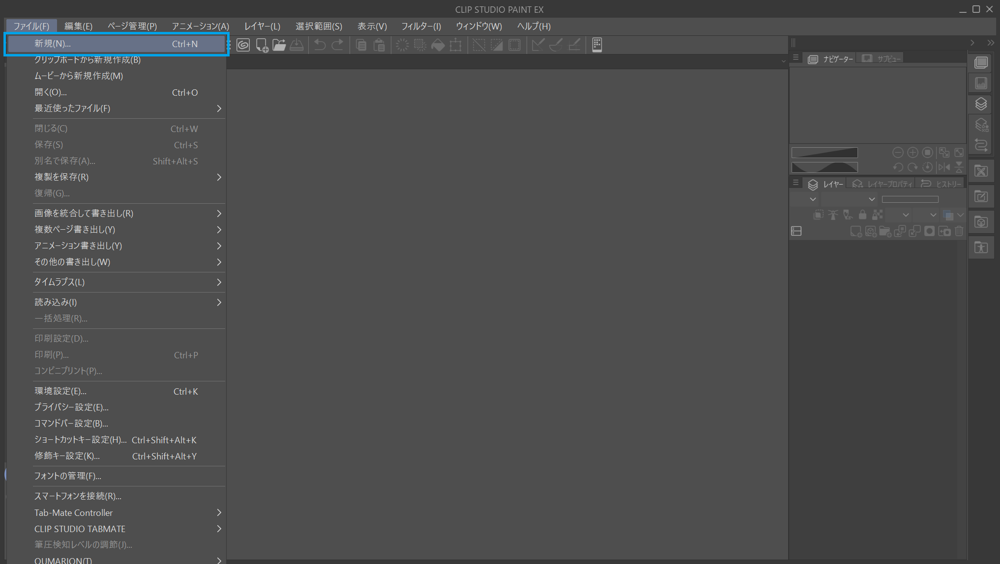

「作品の用途」から「アニメーション」を選択します

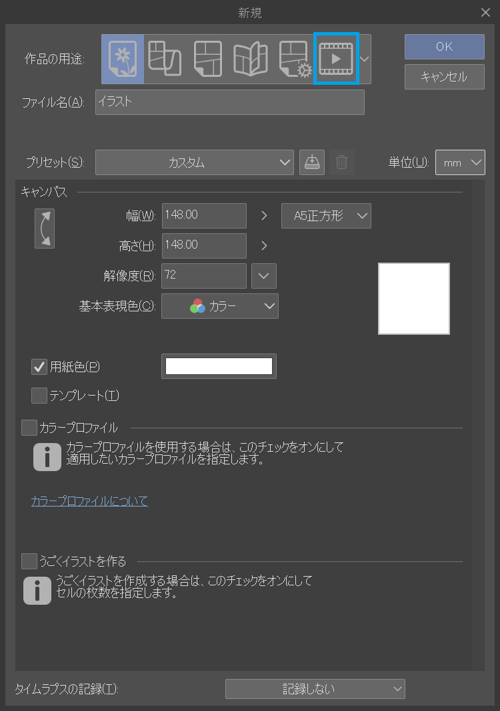

以下のように設定します

|項目                      |設定値  |
|--------------------------|--------|
|単位                      |px|
|基準サイズ                |表示パネルのドット数(128x32など)に設定してください|
|アニメーション作画用紙設定|チェックを入れます|
|余白                      |作画しやすいサイズ（上下左右64など）に設定してください|
|フレームレート            |10fps,15fps,20fp,30fpsのいづれか。15fpsか20fps当たりがおすすめです|
|再生時間                  |作成したいアニメーションの長さを設定してください。単位は「秒＋コマ」がおすすめです|
|変形のピクセル補間        |ハードな輪郭(ニアレストネイバー法)|

上記項目以外はお好みで設定してください

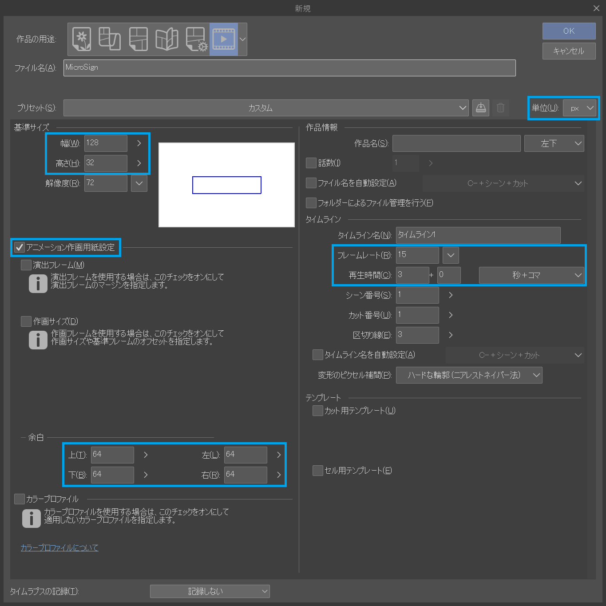

これでファイルの作成を行ってください

### タイムラインパレット表示

CLIP STUDIO PAINTでは、一連のアニメーションを『タイムライン』として扱い、『タイムラインパレット』で編集することができます
タイムラインパレットは初期状態のワークスペースでは非表示のため、メニューからパレットを表示します

メニューから「ウィンドウ」→「タイムライン」を選択します

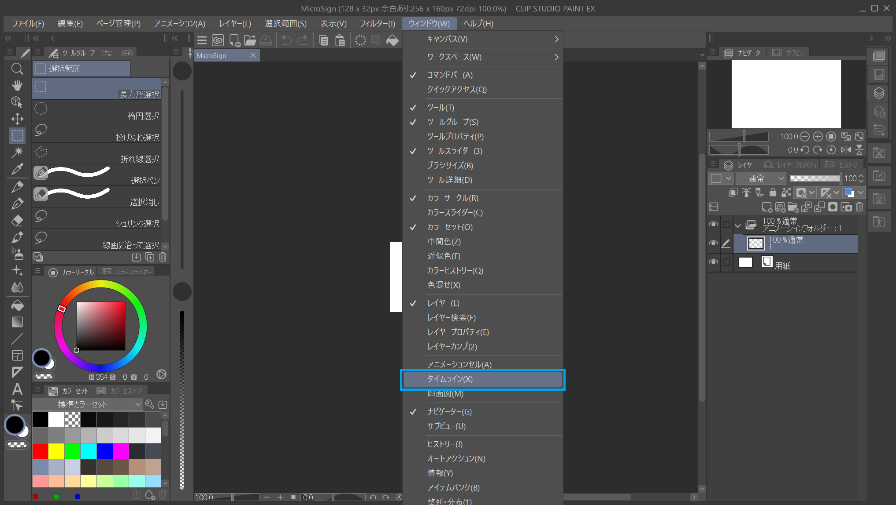

タイムラインパレットが表示されます

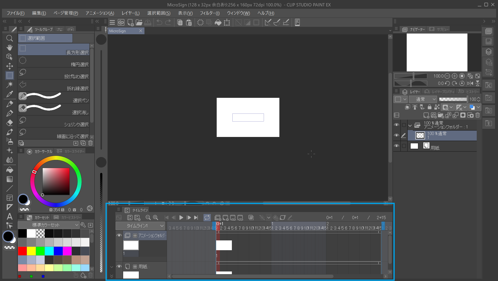

### アニメーション出力

アニメーションの出力を行う画面を開きます

メニューから「ファイル」→「アニメーション書き出し」→「アニメーションGIF」を選択します

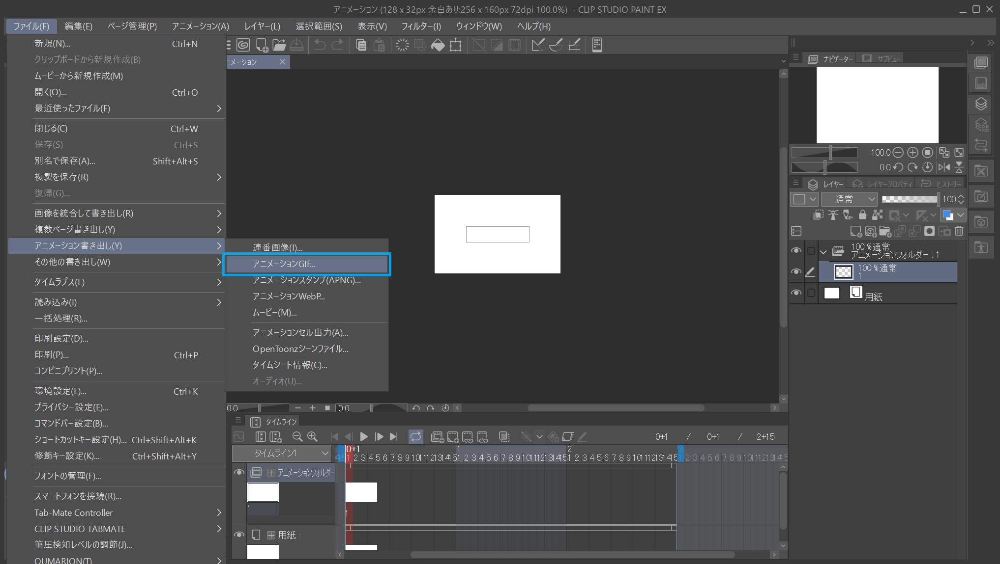

アニメーションGIFの書き出し場所を選択し、保存します

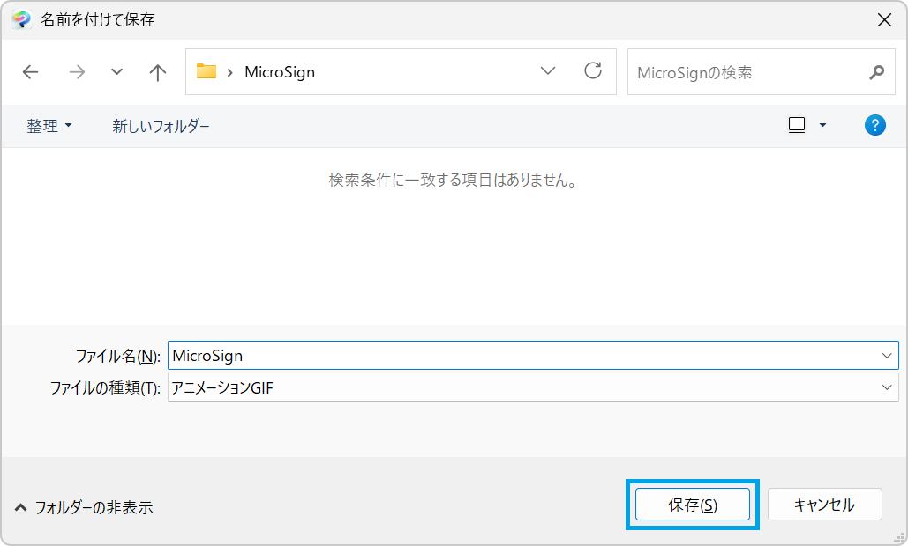

『アニメーションGIF出力設定』画面が開くので、以下のように設定して出力してください

|項目              |設定値                          |
|------------------|--------------------------------|
|幅                |『基準サイズ』と同じ            |
|高さ              |『基準サイズ』と同じ            |
|フレームレート    |作成したアニメーションに合わせる|
|透過情報を書き出す|チェックを外す                  |

その他は出力したいアニメーションに合わせてください

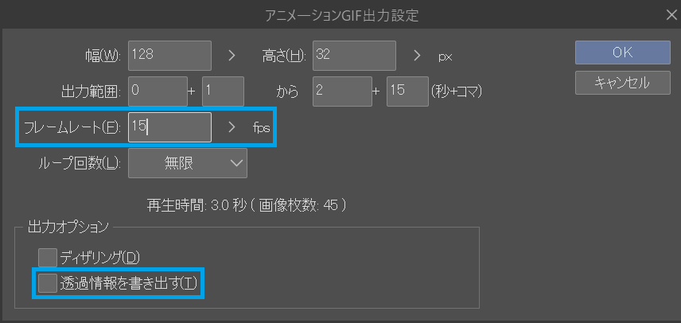

以下のようにアニメーションGIFが出力されます

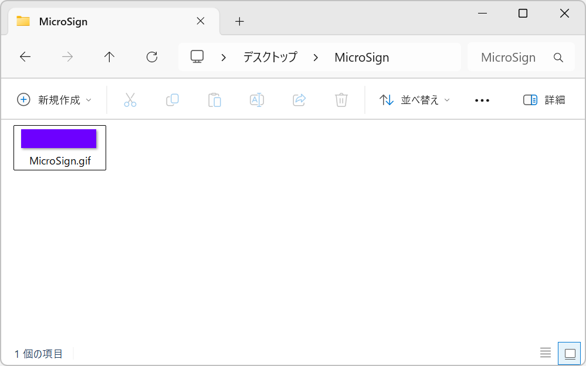

### MicroSignへの取り込み

MicroSignを起動し、ドット数を表示パネルのドット数にします

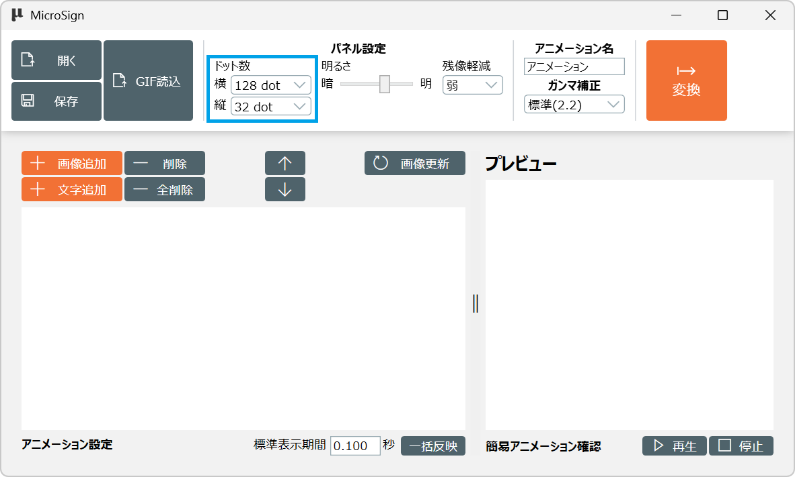

『GIF読込』ボタンをクリックします

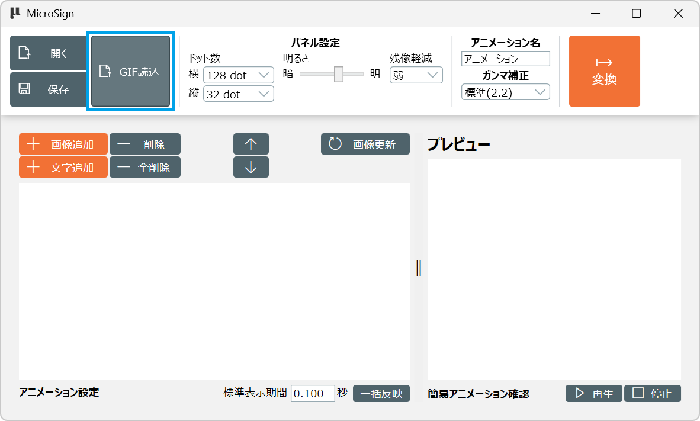

CLIP STUDIO PAINTで出力したアニメーションGIFを選択し、開きます

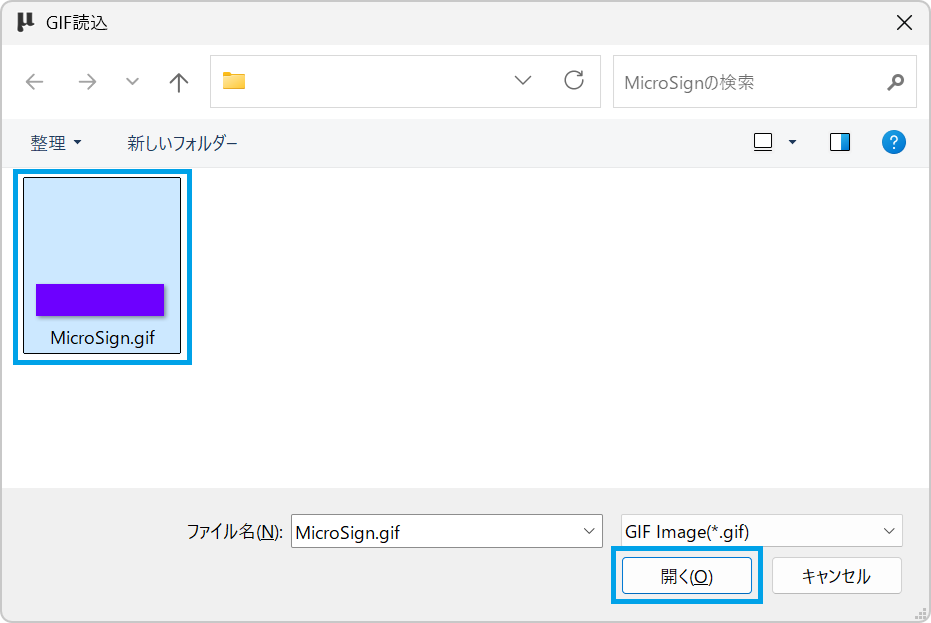

アニメーションGIFのフレームがそのままMicroSignのフレームとして読み込まれます

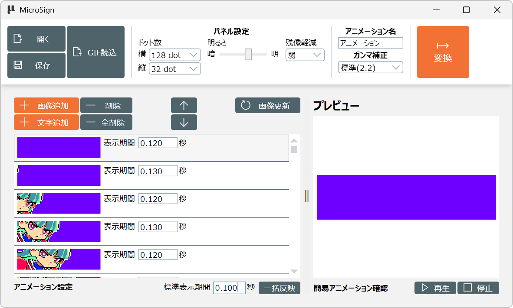
