[操作マニュアル - TOP](./microsign_manual.md) 

## 写真のアニメーションを作成

スマホなどで撮影した写真から単純なスクロールアニメーションを作成する方法です。

MicroSignの操作方法は[基本操作](./microsign_manual_basic.md)を参照してください

ここではMicroSignを起動し、表示パネルのドット数を設定した状態から進めます。

### 写真の選択

「画像追加」ボタンをクリックします。

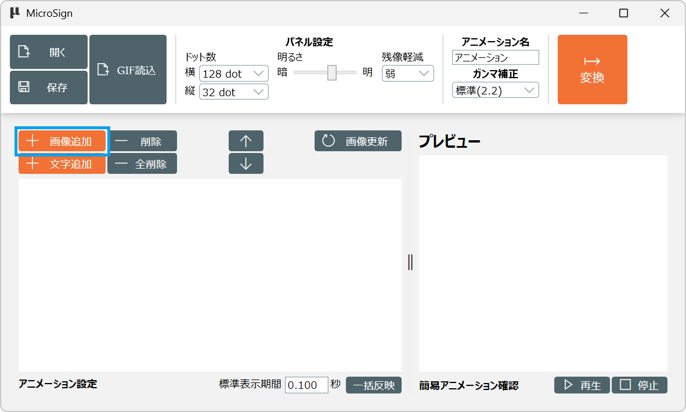

アニメーション画像追加ダイアログが開くので、
表示したい写真を選択し「開く」をクリックします

選択する画像のサイズは、表示パネルのドット数と異なっていても問題ありません。

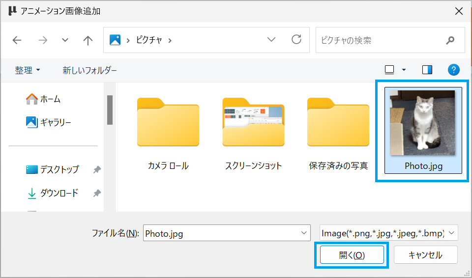

画像切り抜き画面が開きます。

選択した写真が表示パネルのドット数に合わせてリサイズされます。

また写真の縦横比により上下または左右のスクロールする機能が有効になります。

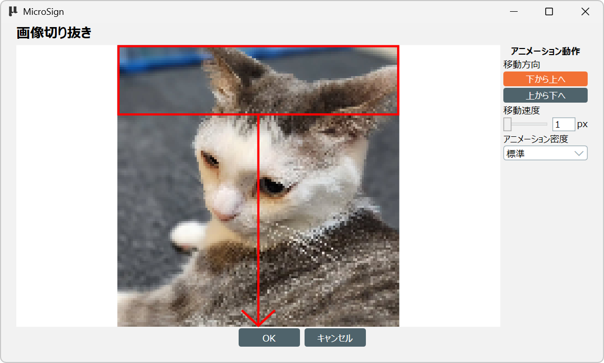

#### 1.移動方向の設定

画像の縦横比により上下または左右のどちらかの移動方向が表示されます

- 上下移動方向時の表示

  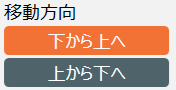

- 左右移動方向時の表示

  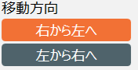

表示された移動方向の選択からアニメーションする方向を指定してください。

- （例）上から下へ選択時

  

- （例）下から上へ選択時

  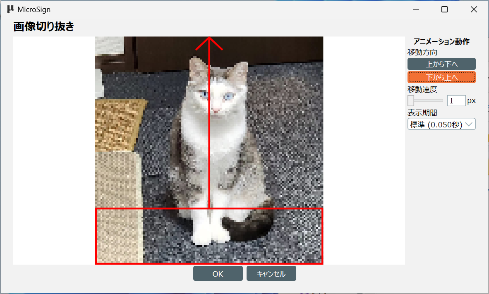

#### 2.移動速度
1の移動方向で選択した方向に移動するとき、1回の移動量をピクセル単位(px)で指定します

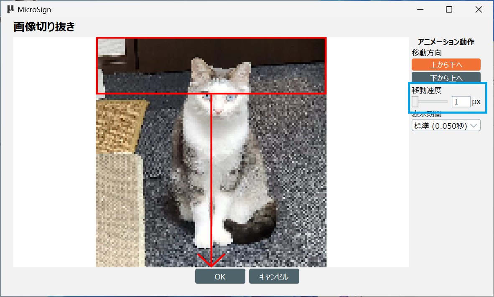

数値を大きくするほど、移動速度が早くなります。

- （例）1px（最小）時

  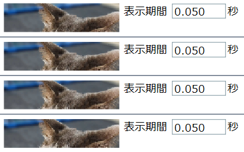

- （例）5px（最大）時 

  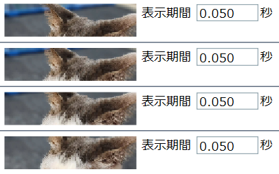

#### 3.表示期間

1フレームの表示期間を指定します

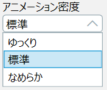

- （例）低速 (0.100秒)時 (=10 fps)

  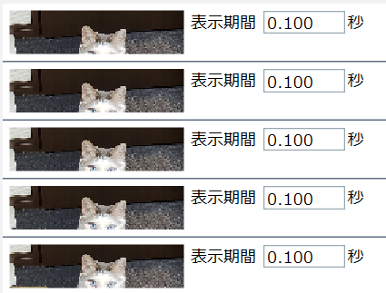

- （例） 標準 (0.050秒)時 (=20 fps)

  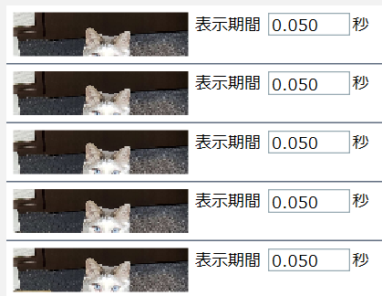

- （例）高速 (0.066秒)時 (=30 fps)

  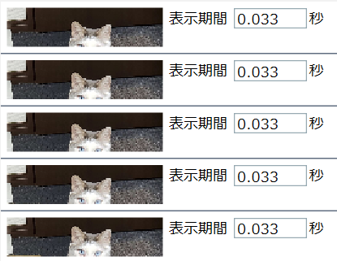

### アニメーション生成

設定が決定したら、「OK」ボタンをクリックします。

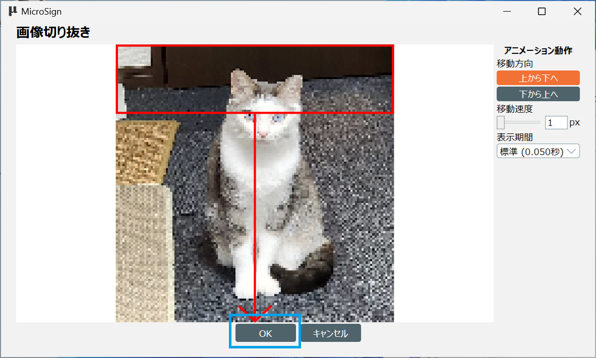

これで写真がフレームごとの画像に切り抜きされ、写真のスクロールアニメーションが生成されます。

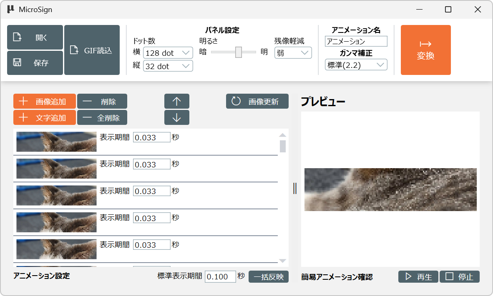
