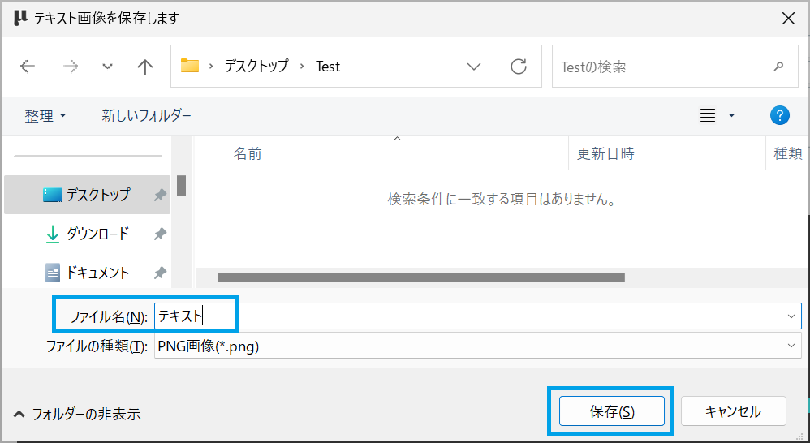
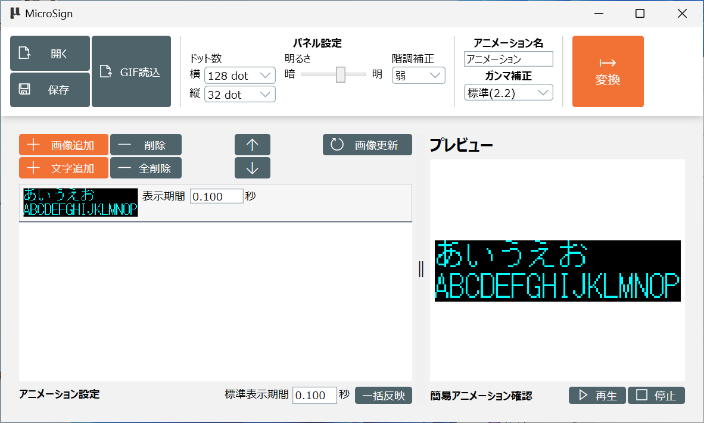
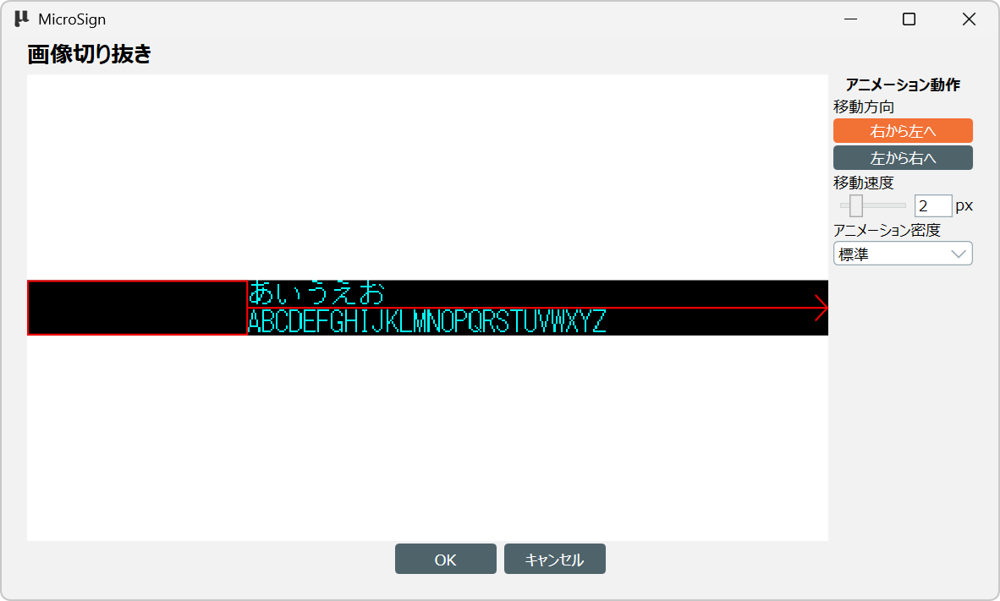
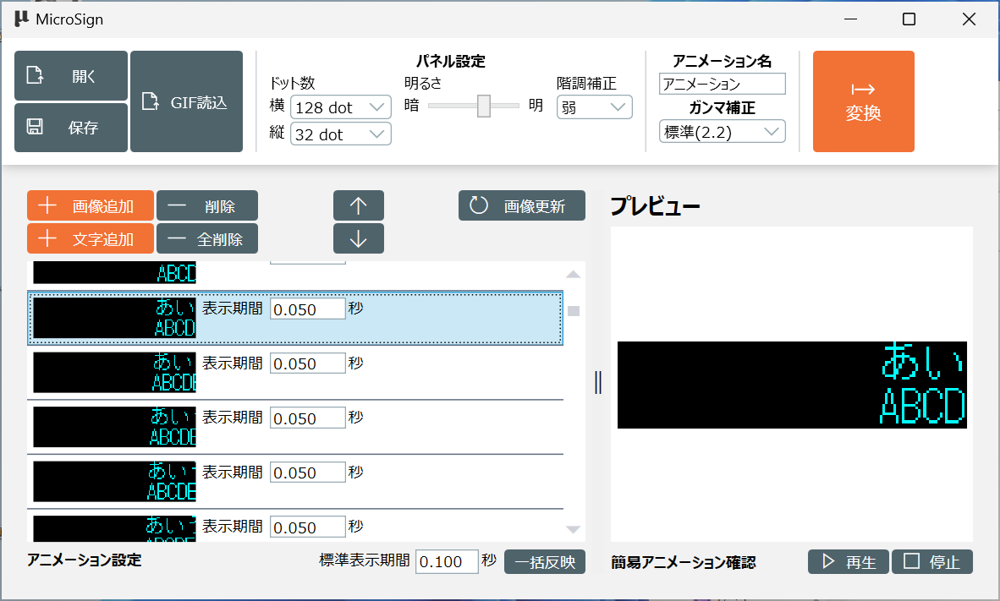

[操作マニュアル - TOP](./microsign_manual.md) 

## 文字を入力してアニメーションを作成する
表示する文字を入力してアニメーションを作成する方法です。

MicroSignの操作方法は「基本操作」を参照してください

ここではMicroSignを起動し、表示パネルのドット数を設定した状態から進めます。

### 文字の追加

「文字追加」ボタンをクリックします。

文字追加画面が表示されます。

### 文章
文章に表示したい文字を入力します

英数字と日本語が使用できます。
入力できる文字数に制限はありませんが、他の設定により文字が見切れる場合があります。

### サイズ
表示する文字のサイズを指定します

小なら３行分、中なら２行、大の場合は1行分の大きさになります

|サイズ       |プレビュー|
|:------------|:---------|
| 小          ||
| 中（標準）  ||
| 大          ||

### 色

表示する文字の色を指定します

全体の文字の色が変わります。途中の文字だけ色を変更することは現状できません。

※細かな演出を行いたい場合はAdobi AfterEffectやClip Studioなどを使ってアニメーションを作成してください

|色      |プレビュー|
|:------------|:---------|
| 白色（標準）||
| 赤色        ||
| 緑色        ||
| 黄色        ||
| 青色        ||
| 紫色        ||
| 水色        ||

### 表示方法

入力した文字の表示方法を選択します。
「スクロール表示」を選択した場合、。

「固定表示」を選択した場合は、

|表示方法         |プレビュー|
|:----------------|:---------|
| スクロール表示  |文章がスクロールして入ってくる追加の設定がこの後に表示されます|
| 固定表示（標準）|現在表示されている内容が表示で決まります|

### 決定
設定が決定したら、『OK』ボタンをクリックします。

テキストを保存します画面が表示されます。
入力した文章を画像として保存するので、画像の保存場所とファイル名を入力し「保存」をクリックします

#### 表示方法で固定表示を選択した場合

保存した画像がフレームとして追加されます。

#### 表示方法でスクロール表示を選択した場合

続けて「1枚画像からアニメーションを作成する」で表示されたの画像切り抜き画面が表示されます

設定方法は「1枚画像からアニメーションを作成する」を参照ください.

画像切り抜き画面で「OK」をクリックすると文字がするロールして表示されるアニメーションが登録されます

