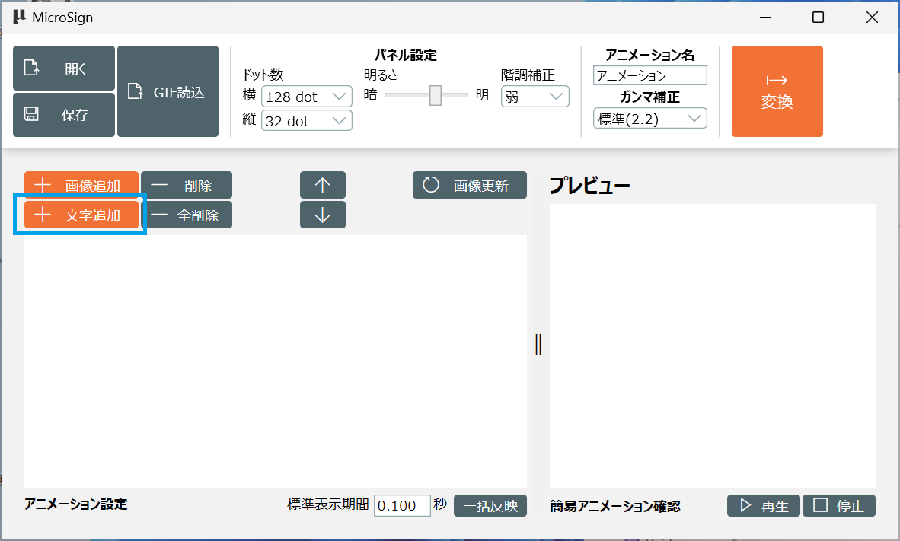
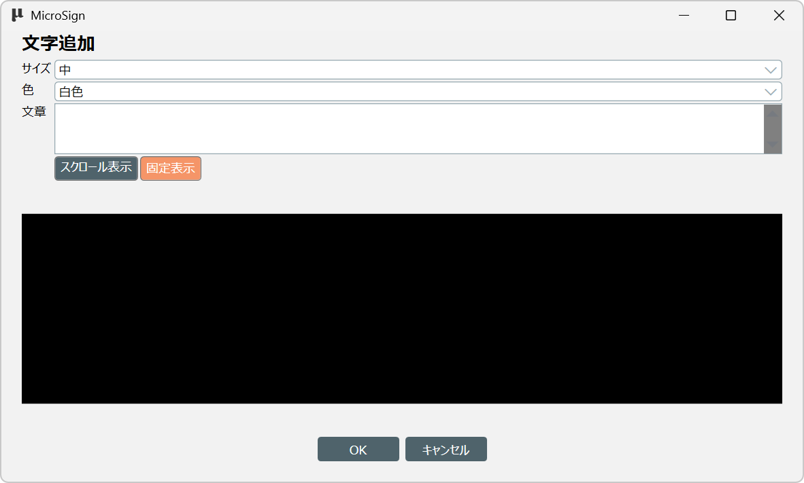
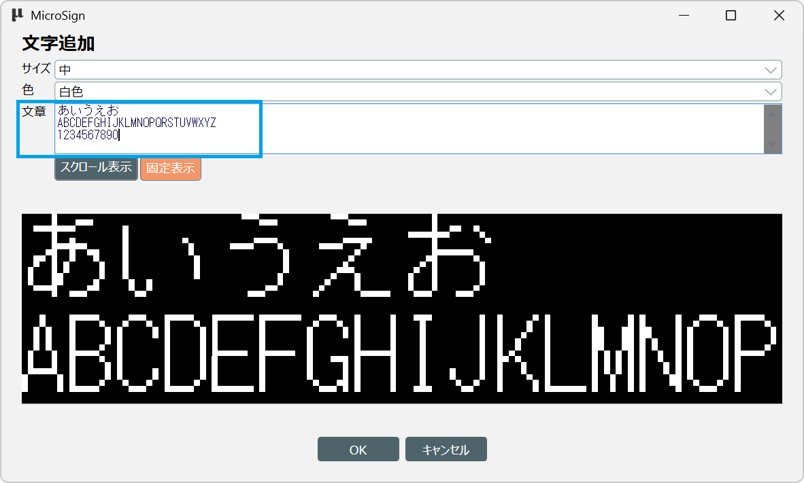
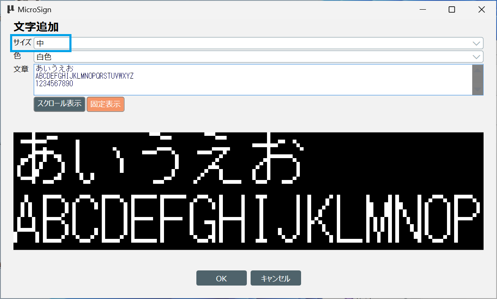
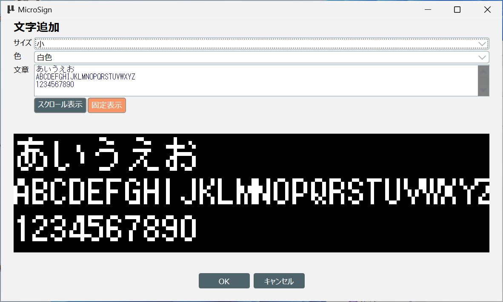
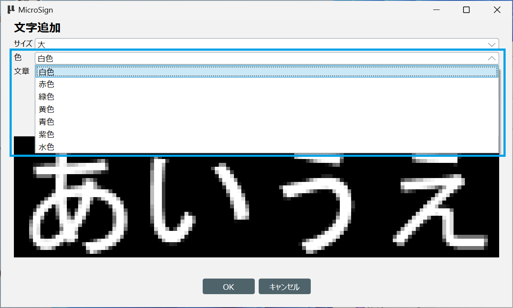
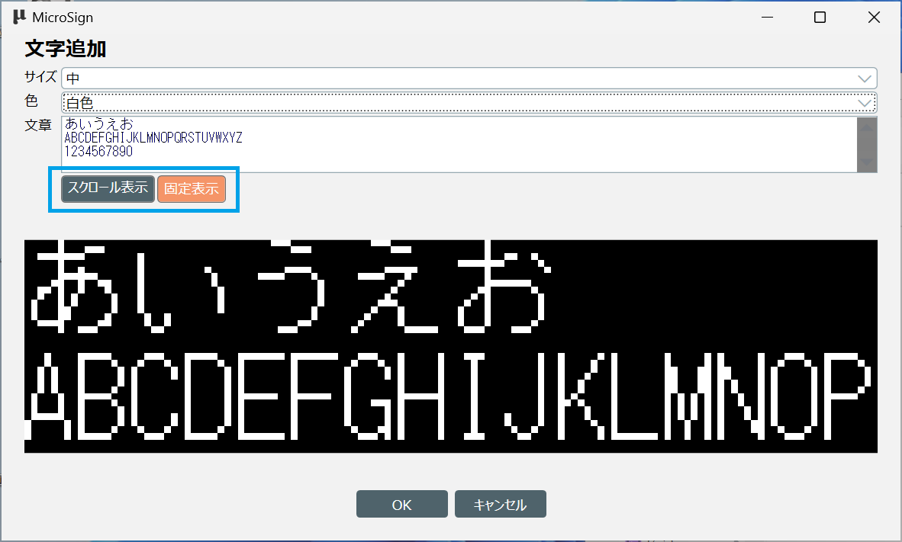
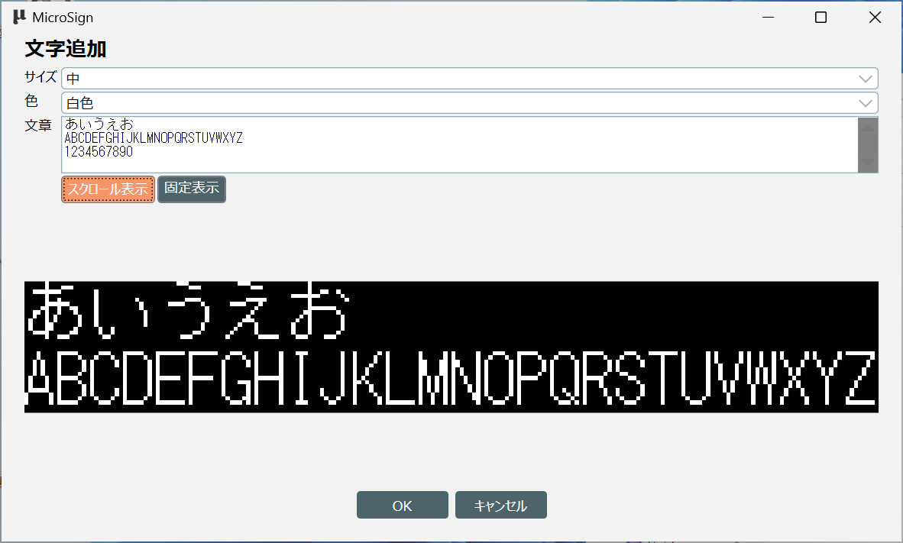
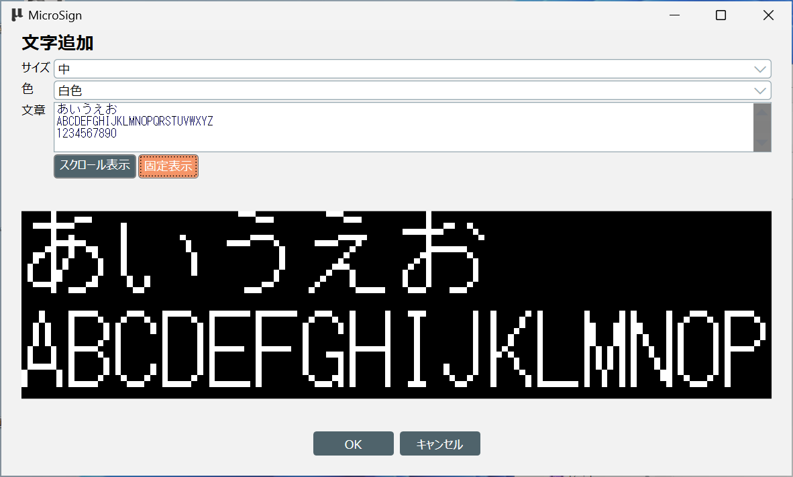
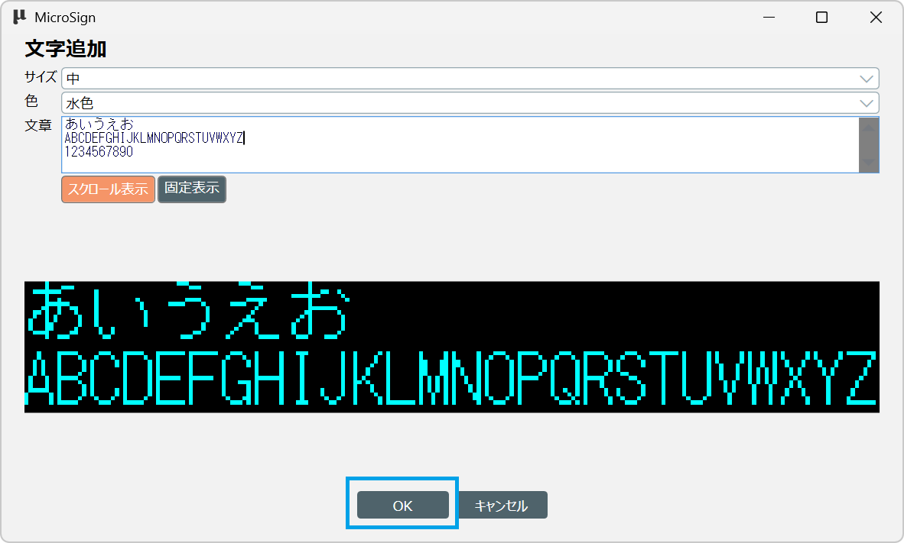

[操作マニュアル - TOP](./microsign_manual.md) 

## メッセージのアニメーションを作成

メッセージのアニメーションを作成する方法です。

MicroSignの操作方法は[基本操作](./microsign_manual_basic.md)を参照してください

ここではMicroSignを起動し、表示パネルのドット数を設定した状態から進めます。

### メッセージの追加

「文字追加」ボタンをクリックします。

文字追加画面が表示されます。

#### 1.文章
文章項目に表示したいメッセージを入力します

英数字と日本語が使用できます。
入力できる文字数に制限はありませんが、他の設定により文字が見切れる場合があります。

#### 2.サイズ
表示するメッセージのサイズを指定します

小なら３行分、中なら２行、大の場合は1行分の大きさになります

- （例）小 選択時

  

- （例）中 選択時
  
  

- （例）大 選択時

  

#### 4.色

表示するメッセージの文字色を指定します

全体の文字の色が変わります。途中の文字だけ色を変更することはできません。

細かな演出を行いたい場合はAdobi AfterEffectやClip Studioなどを使ってアニメーションを作成してください

|色      |プレビュー|
|:------------|:---------|
| 白色（標準）||
| 赤色        ||
| 緑色        ||
| 黄色        ||
| 青色        ||
| 紫色        ||
| 水色        ||

#### 4.表示方法

メッセージの表示方法を選択します。

- 「スクロール表示」を選択した場合

  表示されているメッセージ画像を作成した後に
  「写真のアニメーションを作成」にあった「画像の切り抜き」画面が表示されます。

  

- 「固定表示」を選択した場合

  現在画面に表示されている内容でメッセージ画像が作成され
  そのままフレームとなります

  

### メッセージ画像作成
設定が決定したら、『OK』ボタンをクリックします。

テキストを保存します画面が表示されます。
入力したメッセージを画像として保存するので、画像の保存場所とファイル名を入力し「保存」をクリックします

#### 1.表示方法で固定表示を選択した場合

保存した画像がフレームとして追加されます。

#### 2.表示方法でスクロール表示を選択した場合

続けて「写真のアニメーションを作成」で表示された画像切り抜き画面が表示されます

設定方法は[写真のアニメーションを作成](./microsign_manual_picture.md)を参照ください.

画像切り抜き画面で「OK」をクリックするとメッセージがスクロールして表示されるアニメーションが登録されます

