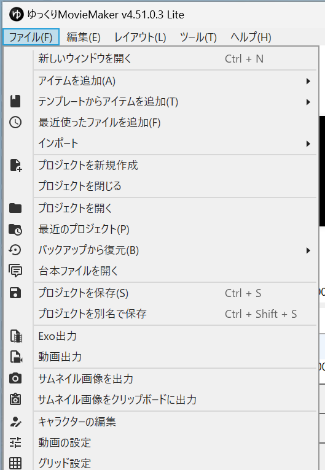
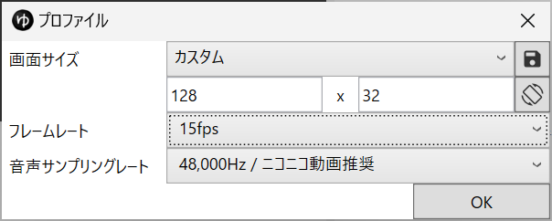
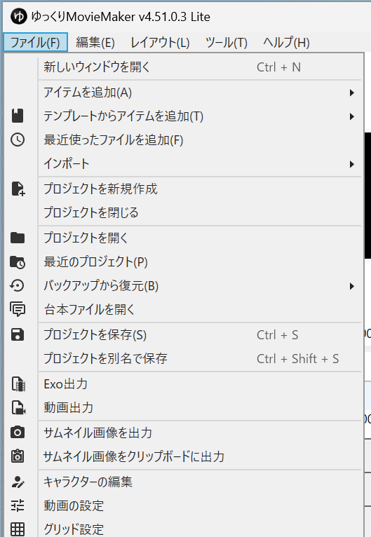
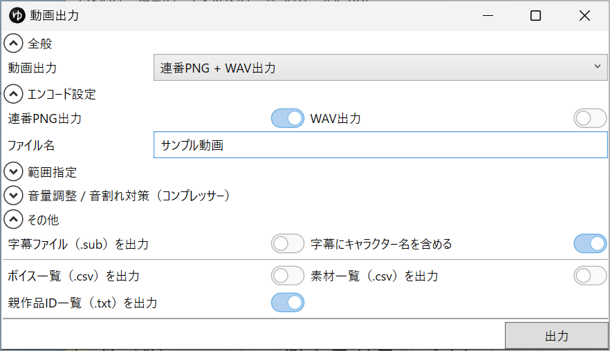
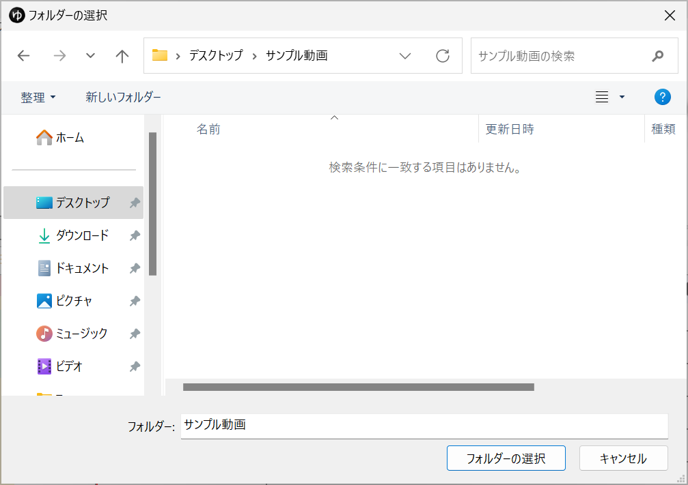
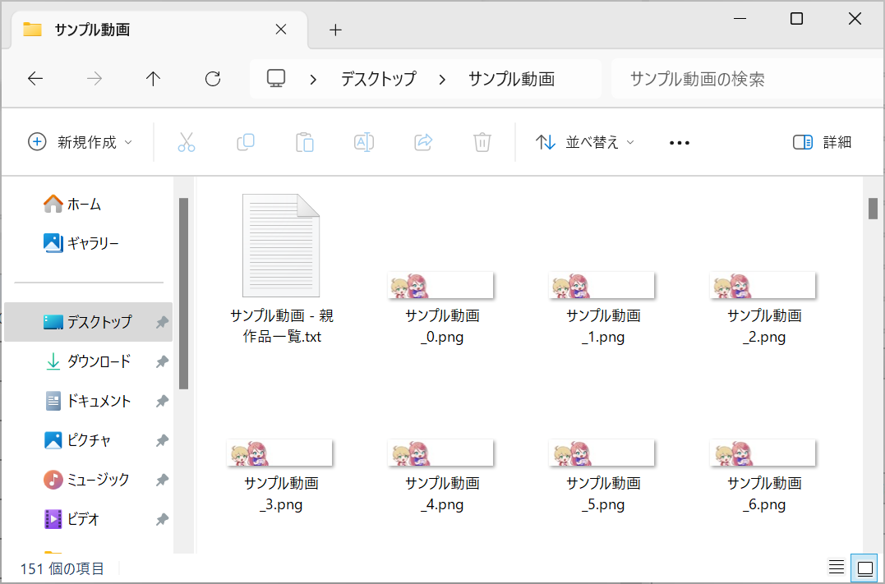
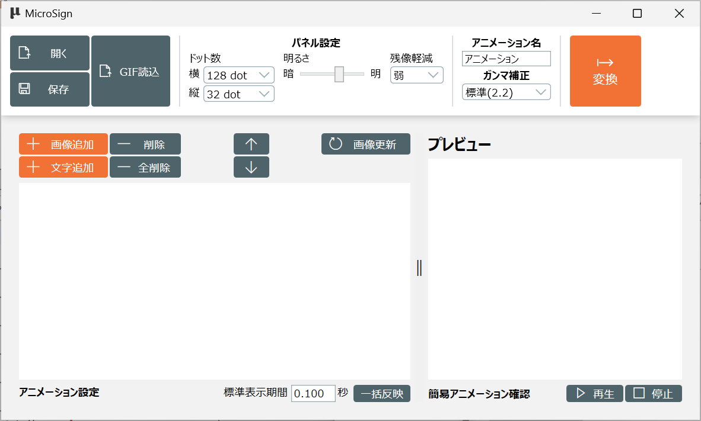
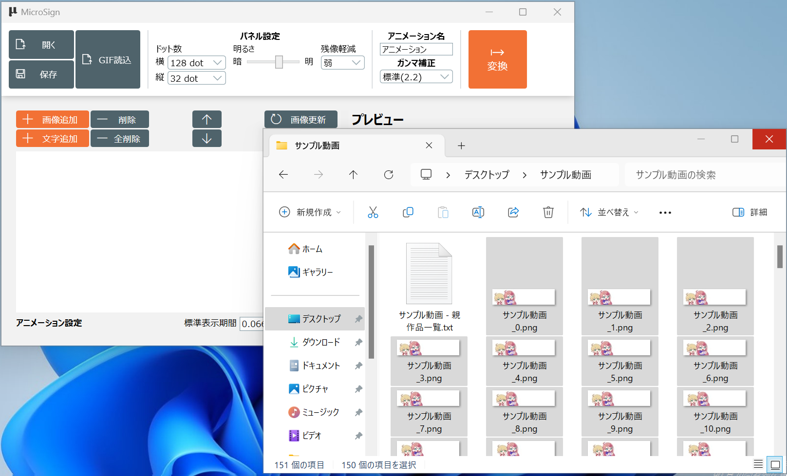

[操作マニュアル - TOP](./microsign_manual.md) 

## ゆっくりMovie Maker 4 を使ったアニメーションの作成

ゆっくりMovie Maker 4 (YMM4) を使って表示パネル向けのアニメーションを作成する方法です

[YMM4](https://manjubox.net/ymm4/)

YMM4 でアニメーションを作成する手順は説明しません。
あくまで YMM4 で表示パネル向けのアニメーションを作成するときの
設定などについて説明します

MicroSignの操作方法は「基本操作」を参照してください

ここではMicroSignを起動し、表示パネルのドット数を設定した状態から進めます。

### 動画の設定

YMM4で一番最初に行う「動画の設定」です
メニューから「ファイル」→「動画の設定」を開きます

以下のように設定してください

|項目          |設定値  |
|--------------|-------|
|画面サイズ     |「カスタム」で表示パネルのドット数(128x32など)に設定してください|
|フレームレート  |10fps,15fps,20fp,30fpsのいづれか。15fpsか20fps当たりがおすすめです|
|音声サンプリングレート|MicroSignでは音声は扱わないのでなんでもよいです|

これで動画の作成を行ってください

### 動画出力

YMM4で動画の出力を行う画面を開きます

動画出力画面が開くので以下のように設定して出力してください

|項目          |設定値           |
|--------------|----------------|
|動画出力       |連番PNG + WAV出力|
|連番PNG出力    |ON              |
|WAV出力        |OFF(ONでもよいですが使用しません)|

その他は出力したい動画に合わせてください

フォルダの選択画面が開くので、連番pngを出力するフォルダを選択します

以下のように動画が出力されます

### MicroSignへの取り込み

MicroSignを起動し、ドット数を表示パネルのドット数にします

標準表示期間をYMM4で設定したFPSの表示期間に設定します
今回は15 fps で作成したので「0.066」を設定します

YMM4で出力した連番PNGをMicroSignのタイムラインにドラッグ＆ドロップして
連番PNGをフレームとして登録します

