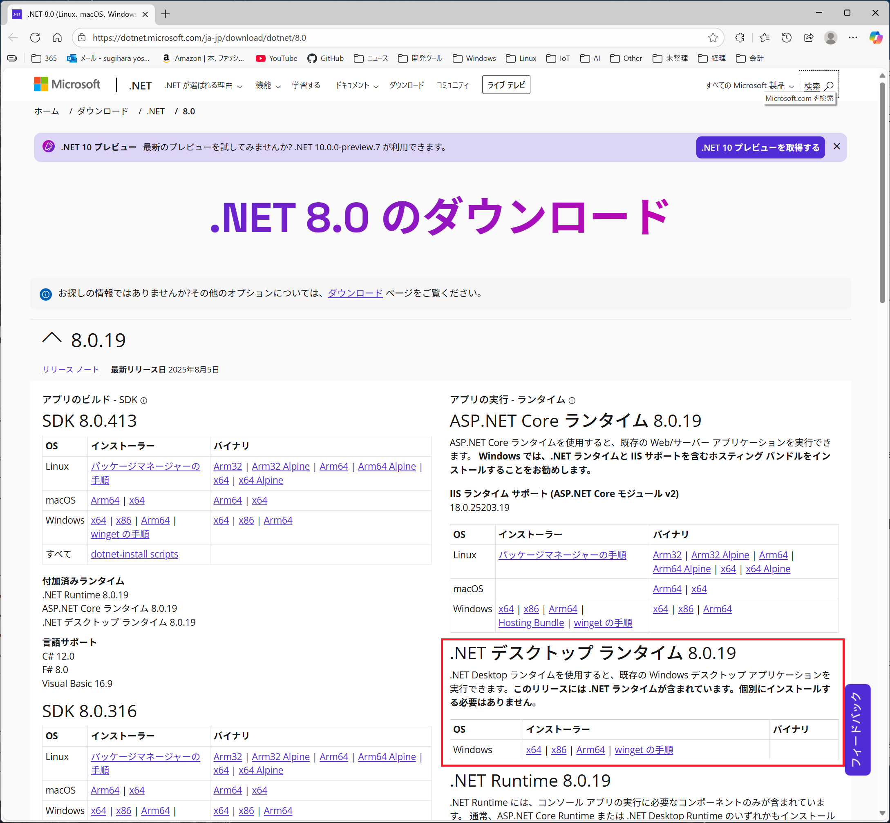

# MicroSign アニメーション作成アプリ

デジタルネイサージ「MicroSign」向けのアニメーション作成アプリケーションです

## プロジェクト

MicroSignで再生するアニメーションを作成するアプリケーション

[MicroSign/MicroSign.sln](MicroSign/MicroSign.sln)

実行するのに.NET8 が必要になります
 .NET8は以下のURLからダウンロードできます

[.NET 8.0 のダウンロード](https://dotnet.microsoft.com/ja-jp/download/dotnet/8.0)

最新バージョンの「.NET デスクトップ ランタイム」をインストールしてください

## サンプルアニメーション一覧

### MicroSign パネルテスト アニメーション

[MicroSign パネルテスト アニメーション](./SampleAnimations/MicroSignパネルテストアニメーション/)

MicroSignの全LEDが正しく点灯しているか確認するためのアニメーション

画像はペイントで作成
２秒ごとに画像が切り替わります

### MicroSign プロモーション アニメーション

[MicroSign プロモーション アニメーション](./SampleAnimations/MicroSignプロモーションアニメーション/)

MicroSignのプロモーション用に作成したアニメーション

Clip Studio PAINTのアニメーション機能を使ってアニメーションを用意しました

## 更新履歴

### v 1.3.3.2

2025.09.30:CS)土田

- マトリクスLEDパネルと異なるサイズの画像に対応
   
  ボタン操作またはドラッグ＆ドロップで追加した画像が
  パネルサイズと異なるサイズの場合、
  画像の切り抜きを行う画面が表示されるようになりました

  読み込んだ画像をマトリクスLEDパネルにあわせてリサイズする他、
  画像をスクロールさせて簡易的なアニメーションを作成できます

### v 1.3.2.1

2025.08.21:CS)土田

- 残像軽減機能に対応
   
  実機でアニメーションを表示する際の
  残像を軽減する機能を追加しました

  LEDをごく短い時間消灯することで残像を軽減するため、
  なしの場合よりも暗い色を表現できるようになりますが、
  強くしていくとちらつきが起こる場合があります

  初期値は残像軽減ありで、値は「弱」です

### v 1.3.1.1

2025.08.19:CS)杉原

- ガンマ補正機能に対応
   
  アニメーションを実機で表示した際の発色が、
  PC用モニターで表示される色に近くなるように、
  ガンマ補正を行う機能を追加しました

  初期値はガンマ補正ありで、ガンマ値は「2.2」です

### v 1.3.0.1

2025.08.13:CS)杉原

- 256パレット対応
   
  以前は(R,G,B)=(3bit,3bit,2bit)の256色固定でしたが、
  GIFの256パレット相当の実装を追加しました

  MicroSign本体のバージョンはv3.02以上が必要です

### v 1.2.0.1

2025.07.20:CS)杉原

- .NET8対応

  .NET6から.NET8に変更しました

- 全画像削除ボタンを追加

  登録しているアニメーション画像をすべて削除するボタンを追加しました

- GIFファイル読込を追加

  GIFファイルの読込に対応しました